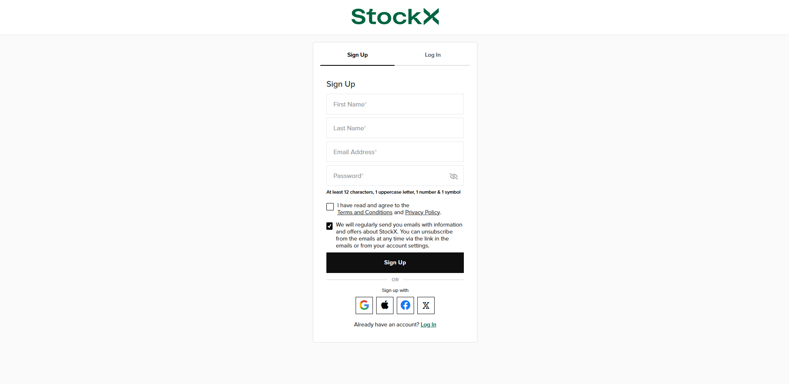
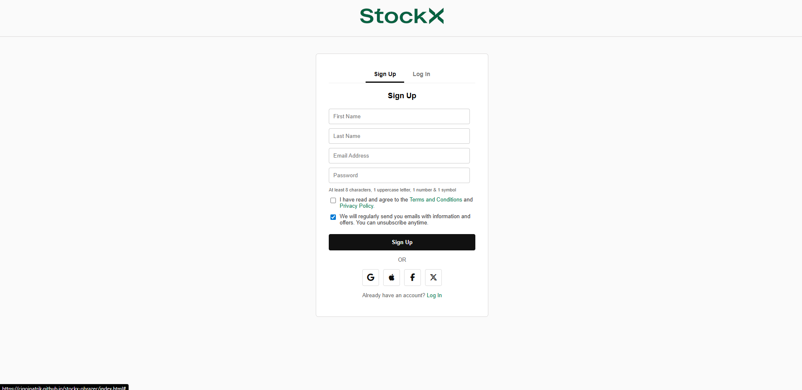

# Replica of StockX

This project is a clean, modern clone of the **StockX sign-up / sign-in pages**, created for learning and practicing web development. It includes fully functional form validation, a responsive layout, and SweetAlert2 pop-up messages.

---

## Features

### **Sign Up Page**
- Validation for:
  - empty fields  
  - correct email format  
  - password requirements (shown as instructions)  
  - mandatory Terms & Conditions checkbox  
- Minimal, StockX-style UI  
- SweetAlert2 pop-up alerts (Error / Success)

### **Log In Page**
- Validation for:  
  - email correctness  
  - password correctness  
  - valid email format  
- Fake login system  
  - Example credentials: `test@test.com` / `12345`
- SweetAlert2 alerts for all actions

---

##  Pages

- `index.html` → **Sign Up**
- `stocx-signin.html` → **Log In**
- `style.css` → Main styling
- Images (favicon + logo)

---

##  Technologies Used

- **HTML5**  
- **CSS3** (responsive)  
- **Vanilla JavaScript**  
- **SweetAlert2** (notifications)  
- **FontAwesome** (social icons)

---

##  Responsive Design

The page is fully responsive for:
- mobile devices  
- tablets  
- smaller screen widths  

The media query adjusts the logo size, button padding, and icon sizes.

---

##  Author

**Patrik Cigoj**  
Clicking the logo inside the project displays a Credits pop-up.

## Original website:

## Replica of website:

